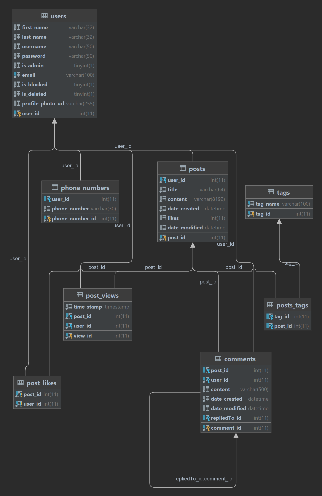

Forum System

Project Description

The Movie Forum System is designed to facilitate community discussions where users can create posts, 
add comments, and like content. 
It's focused on movies.
The system is divided into public, private, and administrative parts, 
each with distinct functionalities like user registration, 
post browsing, and administrative controls.

The users can register, log in, search different users, search posts, create posts, update posts, like and unlike posts,
The users can update their profile, add profile picture also.
Also, it is possible to add tags that are associated with the current post.

